# AI Donation Matcher

## Final Architecture, Data Model, Flows, and Deployment Reference

Last updated: 2026-03-31

This document reflects the current shipped codebase across:

- Backend: Spring Boot 3.2.5, Java 21, PostgreSQL, Firebase Admin, JWT filter chain
- Frontend: React + Vite + Firebase Web SDK
- Hosting target: Render for backend, Vercel for frontend, Neon for PostgreSQL

It replaces the older pre-Firebase and pre-controller-plumbing project write-up.

---

## 1. Executive Summary

AI Donation Matcher is a role-based web platform that connects donors with approved NGOs that publish active material needs. NGOs create and manage needs, donors discover approved NGOs and pledge items, and admins moderate NGO onboarding and platform integrity.

The current production architecture uses Firebase Authentication as the primary identity provider. The frontend signs users in with Firebase Email/Password, then exchanges the Firebase ID token with the backend. The backend verifies the token, resolves the local application user, and authorizes access by role.

### Current live roles

- `DONOR`
- `NGO`
- `ADMIN`

### Core user outcomes

- Donors can register, sign in, browse NGOs, view needs, create pledges, cancel pledges, and follow delivery routes.
- NGOs can register, upload onboarding documents, complete profiles, geocode their address, publish needs, receive pledges, and mark pledged deliveries as received.
- Admins can approve or reject NGOs, suspend NGOs, inspect NGO needs, review reports, and manage moderation data.

### Auth model summary

- Primary auth: Firebase Email/Password
- Backend session transport: bearer token
- Backend verification: Firebase Admin SDK
- Local user model: still stored in PostgreSQL with role, profile, and domain data
- Legacy OTP and old password-login endpoints still exist server-side, but they are not the primary deployed frontend flow

---

## 2. Current System Topology

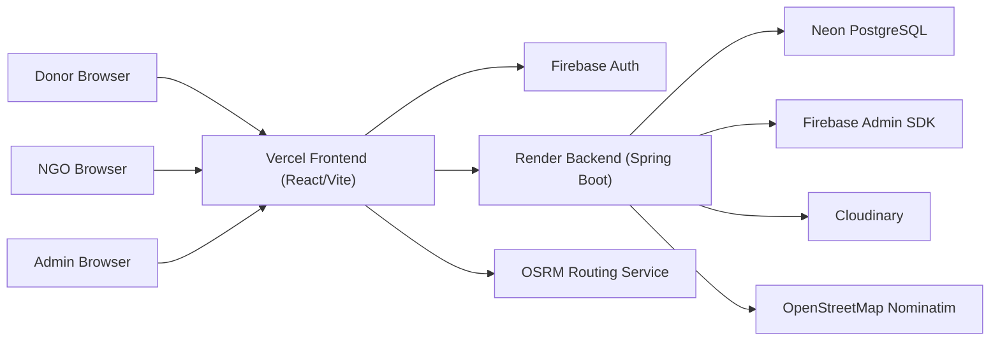

### Responsibility split

- Frontend owns UI, route protection, Firebase sign-in/sign-up, map rendering, and delivery navigation.
- Backend owns role resolution, business rules, persistence, moderation, need lifecycle, pledge lifecycle, and security.
- Firebase owns authentication credentials, password reset, and email verification for the active flow.
- Neon owns durable domain data.

---

## 3. Domain Model

### Core entities

- `User`: app identity, role, email, Firebase UID linkage
- `Ngo`: NGO public profile, verification state, geocoded location, trust score
- `Need`: request for a specific item category and quantity
- `Pledge`: donor commitment against a need
- `Report`: donor-submitted moderation report against an NGO

### Current ER diagram

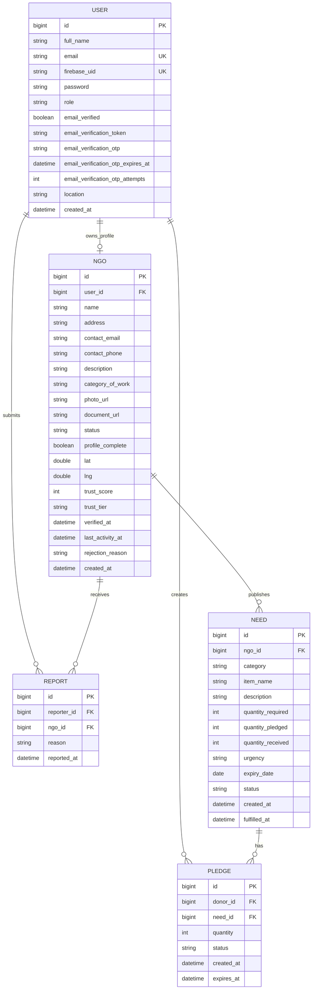

### Important domain rules

- One `User` may have one NGO profile.
- Discovery only returns `APPROVED` NGOs.
- Discovery no longer requires `profile_complete = true` for approved NGOs.
- Need creation is capped at 5 active needs per NGO.
- Need edit/delete is blocked if quantity has already been pledged.
- Pledge creation is donor-only.
- Pledge creation no longer blocks on `email_verified`.
- Active pledges expire automatically after 48 hours.
- Need completion is driven by quantities received, not only pledged.

---

## 4. Backend Architecture

### Layering

- `controller`: REST endpoints
- `service`: business logic and transactions
- `repository`: JPA access and native queries
- `config`: security, Firebase, Cloudinary, JWT filter, Swagger wiring

### Main backend components

- `SecurityConfig`
- `JwtFilter`
- `FirebaseConfig`
- `FirebaseAuthService`
- `AuthService`
- `NgoService`
- `NeedService`
- `PledgeService`
- `AdminService`
- `ReportService`
- `ScheduledJobService`
- `EmailService`
- `GeocodingService`
- `TrustScoreService`

### Security model

Public endpoints:

- `/swagger-ui.html`
- `/swagger-ui/**`
- `/v3/api-docs/**`
- `/api/auth/**`
- `GET /api/ngos/**`
- `GET /api/needs/*`

Role-restricted:

- `/api/pledges/**` -> `DONOR`
- `/api/ngo/**` and NGO need mutation endpoints -> `NGO`
- `/api/admin/**` -> `ADMIN`

---

## 5. Frontend Architecture

### Main frontend building blocks

- Firebase initialization: `src/firebase.js`
- API client with bearer token injection: `src/api/axios.js`
- Route tree: `src/App.jsx`
- Auth state: `src/auth/AuthContext.jsx`
- Donor pages:
  - `Login.jsx`
  - `Register.jsx`
  - `DiscoveryMap.jsx`
  - `NgoProfile.jsx`
  - `PledgeScreen.jsx`
  - `DeliveryView.jsx`
  - `DonorDashboard.jsx`
- NGO pages:
  - `NgoDashboard.jsx`
  - `NgoProfileCompletion.jsx`
- Admin page:
  - `AdminDashboard.jsx`

### Frontend route model

Public routes:

- `/login`
- `/register`
- `/verify-email`

Protected donor routes:

- `/`
- `/ngo/:ngoId`
- `/pledge/:needId`
- `/delivery/:pledgeId`
- `/donor/dashboard`

Protected NGO routes:

- `/ngo/dashboard`
- `/ngo/complete-profile`

Protected admin route:

- `/admin/dashboard`

---

## 6. End-to-End Authentication Flow

## 6.1 Firebase-backed donor login

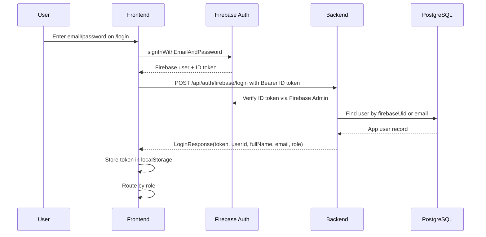

### Actual backend resolution logic

1. Frontend signs in with Firebase.
2. Frontend sends Firebase ID token to `/api/auth/firebase/login`.
3. Backend verifies the token.
4. Backend resolves the local user by:
   - `firebaseUid`, or
   - matching email if the account is not yet linked
5. Backend links `firebaseUid` if needed.
6. Backend returns app identity and role.

### Important notes

- Frontend uses Firebase for credential validation.
- Backend still returns a token field in `LoginResponse`, but the active frontend stores and reuses the Firebase ID token as the bearer token.
- Legacy `/api/auth/login` still exists but is not the main frontend path.

## 6.2 Firebase-backed signup

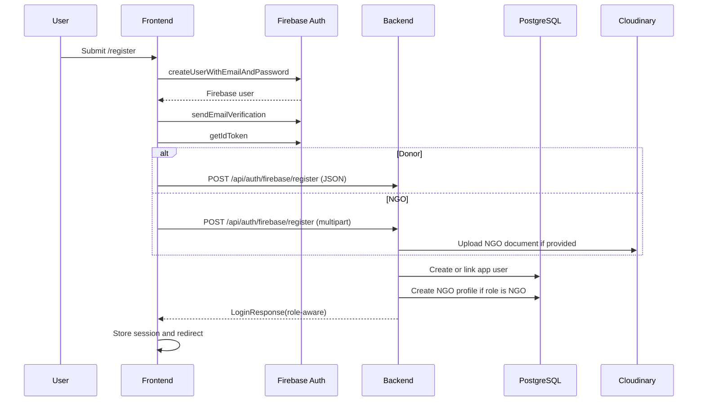

### Current donor signup behavior

- Creates Firebase account
- Sends Firebase verification email
- Creates local `User`
- Returns donor app session
- Redirects donor to `/`

### Current NGO signup behavior

- Creates Firebase account
- Sends Firebase verification email
- Creates local `User`
- Creates local `Ngo` with:
  - `status = PENDING`
  - `profileComplete = false`
  - `trustTier = NEW`
- Uploads document if supplied
- Redirects NGO to `/ngo/complete-profile`

## 6.3 Legacy auth paths still present

These backend endpoints still exist but are not the primary deployed frontend flow:

- `POST /api/auth/register`
- `POST /api/auth/login`
- `POST /api/auth/resend-verification`
- `POST /api/auth/send-registration-otp`
- `POST /api/auth/send-otp`
- `POST /api/auth/verify-otp`
- `GET /api/auth/verify`

They should be treated as compatibility or dormant paths unless the frontend is intentionally wired back to them.

---

## 7. NGO Approval and Go-Live Flow

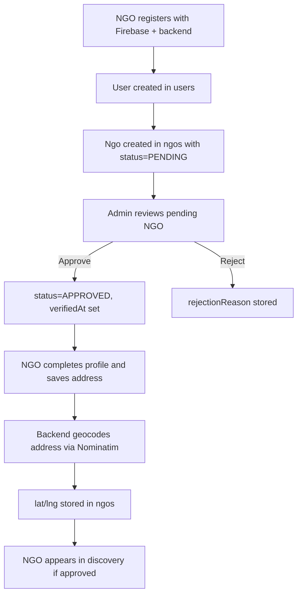

### Current approval requirements

- NGO registration alone does not make an NGO publicly discoverable.
- Admin approval is required.
- Profile completion improves trust and usability, but the discovery query now keys off approval status rather than `profileComplete`.
- Valid `lat/lng` are required for radius-based nearby discovery.

---

## 8. NGO Profile and Geocoding Flow

### Trigger

- `PUT /api/ngo/my/profile`

### Data written

- NGO name
- NGO contact fields
- NGO description
- NGO category of work
- NGO address
- geocoded `lat` and `lng`
- `profileComplete`
- recalculated trust score

### Geocoding flow

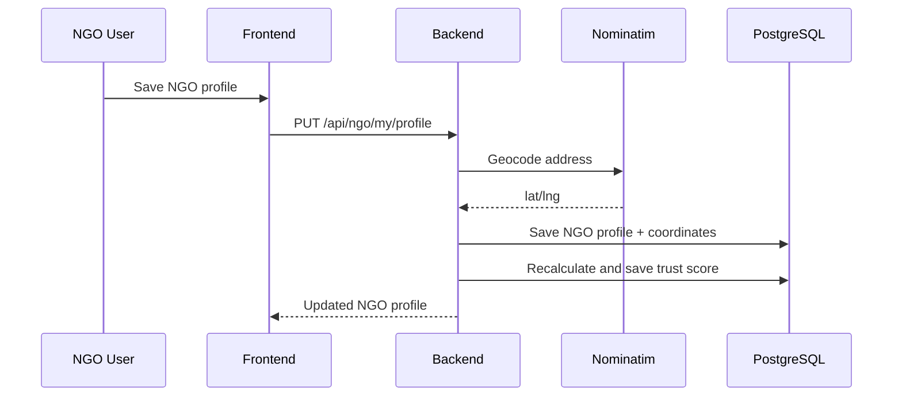

### Geocoding behavior

- Non-blank addresses are fail-fast if they cannot be geocoded.
- Blank address clears `lat` and `lng`.
- Frontend should preserve user input if geocoding fails and let the NGO retry.

---

## 9. Discovery Flow

### Public discovery endpoints

- `GET /api/ngos`
- `GET /api/ngos/{id}`
- `GET /api/needs/{id}`

### Discovery query behavior

- If `lat` and `lng` are provided:
  - backend runs a native Haversine query over approved NGOs with coordinates
  - sorted by distance ascending
- If `lat` and `lng` are not provided:
  - backend returns all approved NGOs through the non-distance query
  - sorted by trust score descending
- Optional filters:
  - `radius`
  - `category`
  - `search`

### Important current rule

Approved NGOs are included in discovery even when `profileComplete = false`.

That change was made to stop approved NGOs with valid coordinates from being silently excluded from the public map.

### Discovery flow

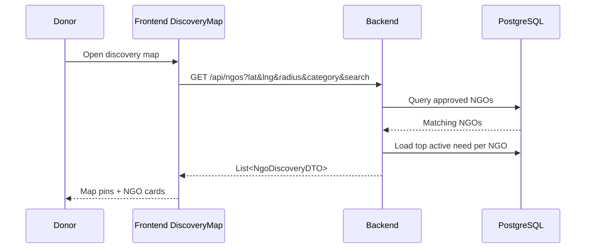

### Current detail page behavior

- `/ngo/:ngoId` fetches `GET /api/ngos/{id}`
- response contains public NGO profile and `activeNeeds`
- frontend also has a placeholder for `fulfilledHistory`, but the backend currently returns `activeNeeds` only in `NgoDetailResponse`

---

## 10. Needs Management Flow

### NGO need endpoints

- `GET /api/ngo/my/needs`
- `POST /api/needs`
- `PUT /api/needs/{id}`
- `DELETE /api/needs/{id}`
- `PATCH /api/needs/{id}/fulfill`

### Rules

- max 5 active needs per NGO
- update/delete blocked once any quantity is pledged
- fulfillment requires received quantity to meet full need total

### Need lifecycle states

- `OPEN`
- `PARTIALLY_PLEDGED`
- `FULLY_PLEDGED`
- `FULFILLED`
- `EXPIRED`

### Need state transitions

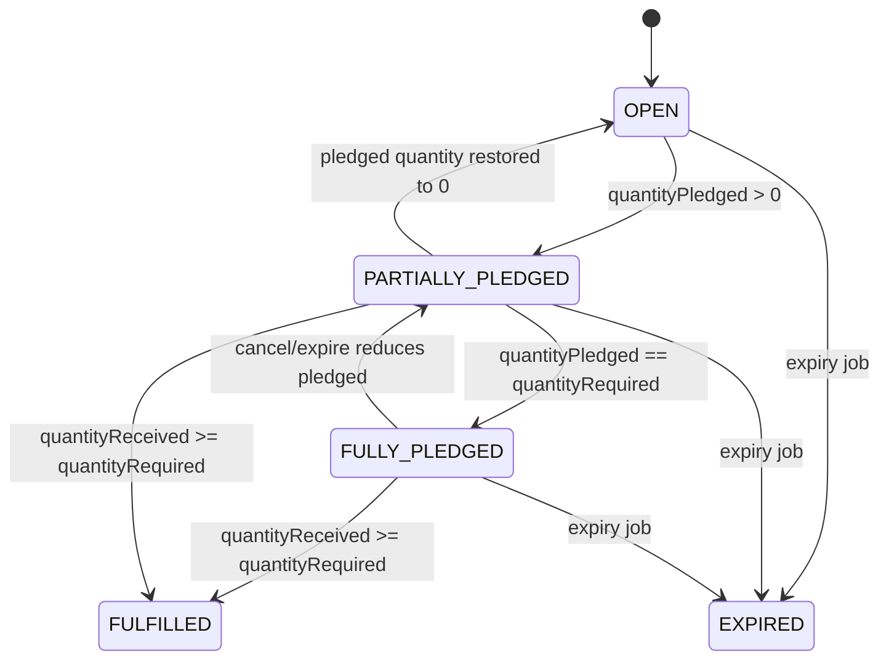

---

## 11. Pledge Flow

### Donor pledge endpoints

- `POST /api/pledges`
- `GET /api/pledges/{id}`
- `DELETE /api/pledges/{id}`
- `GET /api/pledges/active`
- `GET /api/pledges/history`

### Pledge creation sequence

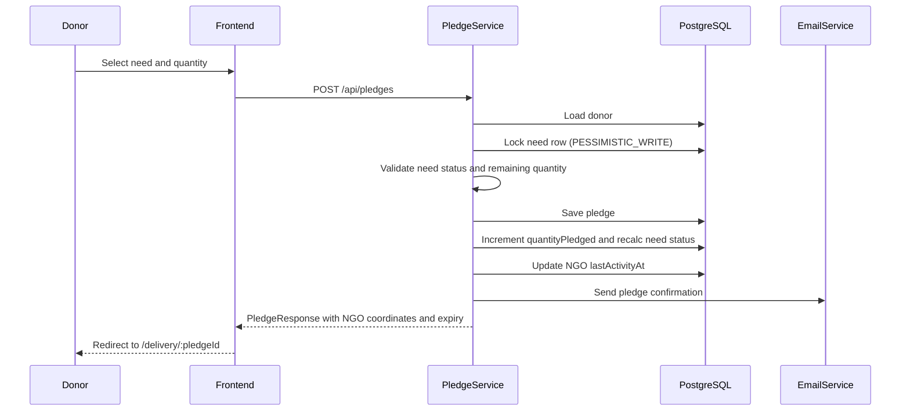

### Key pledge rules

- donor-only endpoint family
- no `emailVerified` gate anymore
- need row locked with pessimistic write to avoid over-pledging
- expiry is set to 48 hours from creation
- response includes NGO coordinates, address, contact email, and expiry time

### Pledge status lifecycle

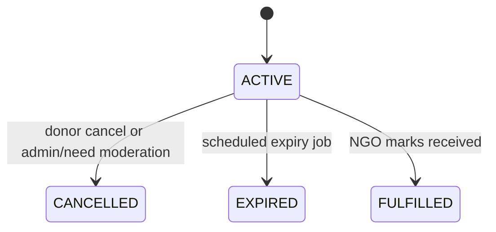

### Delivery flow

- frontend opens `/delivery/:pledgeId`
- backend `GET /api/pledges/{id}` returns destination coordinates and contact details
- frontend uses OSRM to render route between donor location and NGO destination

### Donor dashboard data

- active pledges from `GET /api/pledges/active`
- full history from `GET /api/pledges/history`

---

## 12. Report and Moderation Flow

### Report flow

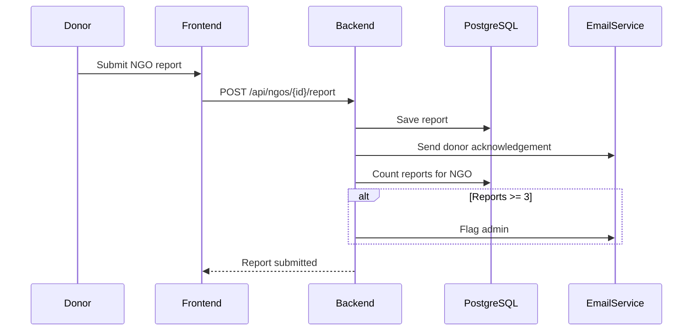

### Admin moderation endpoints

- `GET /api/admin/ngos/pending`
- `GET /api/admin/ngos`
- `GET /api/admin/ngos/{id}/needs`
- `POST /api/admin/ngos/{id}/approve`
- `POST /api/admin/ngos/{id}/reject`
- `POST /api/admin/ngos/{id}/suspend`
- `GET /api/admin/reports`
- `PUT /api/admin/needs/{id}`
- `DELETE /api/admin/needs/{id}`
- `GET /api/admin/stats`

### Suspension cascade

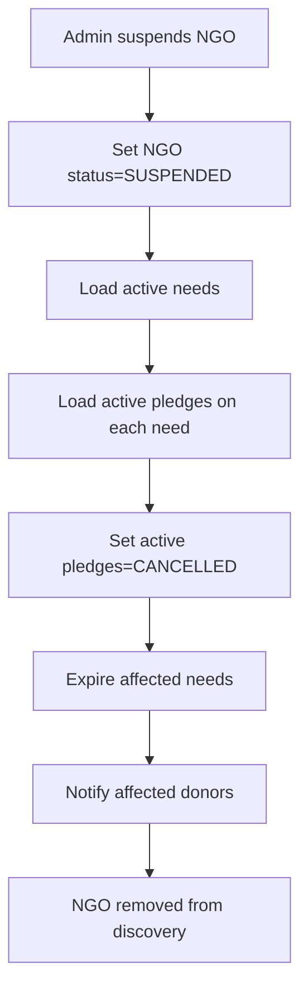

### Current moderation notes

- Suspension is transactional.
- Admin need deletion cancels active pledges and notifies affected donors.
- Report dismissal or reinstatement endpoints are not currently implemented.

---

## 13. Scheduled Jobs and Background Processing

### `ScheduledJobService.expireOldPledges`

- interval: every hour
- target: `ACTIVE` pledges older than 48 hours
- actions:
  - set pledge to `EXPIRED`
  - restore pledged quantity to the need
  - recalculate need status
  - notify donor

### `ScheduledJobService.processNeedExpiry`

- schedule: daily at midnight
- actions:
  - warn NGOs about needs expiring in 3 days
  - expire eligible needs
  - cancel active pledges on expired needs
  - notify NGO

---

## 14. Current API Surface

### Public

- `POST /api/auth/register` legacy
- `POST /api/auth/login` legacy
- `POST /api/auth/firebase/register`
- `POST /api/auth/firebase/login`
- `POST /api/auth/resend-verification`
- `POST /api/auth/send-registration-otp`
- `POST /api/auth/send-otp`
- `POST /api/auth/verify-otp`
- `GET /api/auth/verify`
- `GET /api/ngos`
- `GET /api/ngos/{id}`
- `GET /api/needs/{id}`

### Donor

- `POST /api/ngos/{id}/report`
- `POST /api/pledges`
- `GET /api/pledges/{id}`
- `DELETE /api/pledges/{id}`
- `GET /api/pledges/active`
- `GET /api/pledges/history`

### NGO

- `GET /api/ngo/my/profile`
- `PUT /api/ngo/my/profile`
- `POST /api/ngo/my/photo`
- `GET /api/ngo/my/pledges`
- `PATCH /api/ngo/my/pledges/{pledgeId}/receive`
- `GET /api/ngo/my/needs`
- `POST /api/needs`
- `PUT /api/needs/{id}`
- `DELETE /api/needs/{id}`
- `PATCH /api/needs/{id}/fulfill`

### Admin

- `GET /api/admin/ngos/pending`
- `GET /api/admin/ngos`
- `GET /api/admin/ngos/{id}/needs`
- `POST /api/admin/ngos/{id}/approve`
- `POST /api/admin/ngos/{id}/reject`
- `POST /api/admin/ngos/{id}/suspend`
- `GET /api/admin/reports`
- `PUT /api/admin/needs/{id}`
- `DELETE /api/admin/needs/{id}`
- `GET /api/admin/stats`

---

## 15. Deployment Architecture

### Target deployment topology

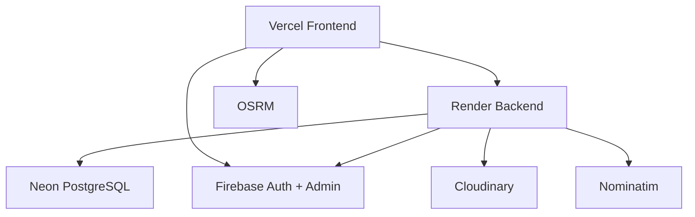

### Backend deployment requirements

- `DB_URL`
- `DB_USERNAME`
- `DB_PASSWORD`
- `JWT_SECRET`
- `JWT_EXPIRATION_MS`
- `APP_BASE_URL`
- `CORS_ALLOWED_ORIGIN_PATTERNS`
- `FIREBASE_ADMIN_CREDENTIALS_JSON`
- `FIREBASE_ADMIN_PROJECT_ID`
- `FIREBASE_MIGRATION_ENABLED=false`
- `CLOUDINARY_CLOUD_NAME`
- `CLOUDINARY_API_KEY`
- `CLOUDINARY_API_SECRET`
- optional transactional mail:
  - `EMAIL_PROVIDER`
  - `RESEND_API_KEY`
  - `MAIL_FROM`

### Frontend deployment requirements

- `VITE_API_BASE_URL`
- `VITE_FIREBASE_API_KEY`
- `VITE_FIREBASE_AUTH_DOMAIN`
- `VITE_FIREBASE_PROJECT_ID`
- `VITE_FIREBASE_STORAGE_BUCKET`
- `VITE_FIREBASE_MESSAGING_SENDER_ID`
- `VITE_FIREBASE_APP_ID`
- `VITE_OSRM_URL`

### Backend to frontend connection

- frontend sends requests to `VITE_API_BASE_URL`
- backend CORS is controlled by `CORS_ALLOWED_ORIGIN_PATTERNS`
- `APP_BASE_URL` should point to the deployed frontend URL

### Render blueprint note

The backend repo includes `render.yaml`, so Render can deploy the backend via Blueprint directly from `main`.

---

## 16. Production Smoke Checklist

### Authentication

- donor Firebase registration works
- donor Firebase login works
- NGO Firebase registration works
- role-based redirects are correct

### Discovery

- `GET /api/ngos` returns approved NGOs
- approved NGOs with valid coordinates appear on the public map
- public NGO detail loads active needs

### Pledges

- donor can create a pledge
- donor can see it in active pledges
- NGO can see incoming pledges
- NGO can mark pledge received

### Admin

- pending NGOs load
- approval works
- reports load
- stats load

---

## 17. Known Gaps and Honest Notes

- Legacy OTP and old password auth code still exists server-side, but the frontend is now Firebase-first.
- `email_verified` still exists in the database as a mirrored field, even though pledge creation no longer depends on it.
- Public NGO detail currently returns `activeNeeds`; the frontend has placeholders for fulfilled history that are not yet wired from the backend response.
- Optional transactional email is separate from Firebase auth mail.
- OSRM and Nominatim are still prototype-friendly dependencies and may need hardening for production scale.

---

## 18. Canonical Source Documents

- [`docs/BACKEND.md`](C:/Users/moham/FYP/AI-Donor-Matcher-Backend/docs/BACKEND.md)
- [`docs/FRONTEND_BACKEND_AGREEMENT.md`](C:/Users/moham/FYP/AI-Donor-Matcher-Backend/docs/FRONTEND_BACKEND_AGREEMENT.md)
- [`docs/DEPLOYMENT_RENDER.md`](C:/Users/moham/FYP/AI-Donor-Matcher-Backend/docs/DEPLOYMENT_RENDER.md)
- [`docs/GEOCODING.md`](C:/Users/moham/FYP/AI-Donor-Matcher-Backend/docs/GEOCODING.md)

This file is the narrative system reference. The endpoint-level contract and deployment docs should stay aligned with it.
